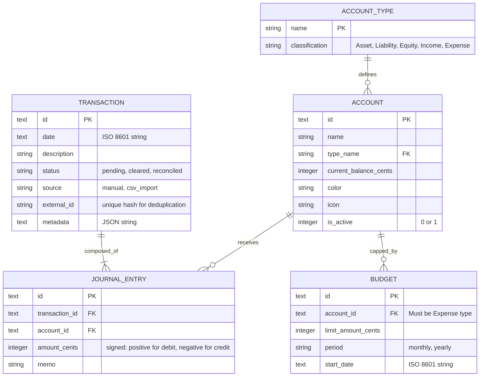

# Database Design & Data Schema

## 1. Overview
This document outlines the database schema for the Finance Prototype, utilizing **double-entry bookkeeping** principles and **SQLite (libSQL)** compatible types. By treating categories as "Nominal Accounts" (Income/Expense) and bank accounts as "Real Accounts" (Asset/Liability), we ensure that every transaction is balanced and verifiable.

### Key Implementation Standards:
- **Integer Cents:** All monetary amounts are stored as `INTEGER` representing cents (e.g., $10.50 is stored as `1050`) to avoid floating-point errors inherent in decimal types.
- **SQLite Compatibility:** Uses `TEXT` for identifiers and dates, and `INTEGER` for amounts and booleans.

## 2. Entity Relationship Diagram

## 3. Data Schema Details

### 3.1 `accounts`
Stores all accounts, including physical bank accounts and virtual categories.
| Column | Type | Constraints | Description |
| :--- | :--- | :--- | :--- |
| `id` | TEXT | PRIMARY KEY | Unique identifier (UUID string). |
| `name` | TEXT | NOT NULL | User-defined name (e.g., "Chase Checking", "Groceries"). |
| `type` | TEXT | NOT NULL | `asset`, `liability`, `equity`, `income`, `expense`. |
| `color` | TEXT | | Hex code for UI representation. |
| `icon` | TEXT | | Lucide icon name. |
| `is_system` | INTEGER | DEFAULT 0 | 1 for accounts like "Opening Balance Equity". |

### 3.2 `transactions`
Metadata for a financial event. A single transaction MUST have at least two related `journal_entries` that sum to zero.
| Column | Type | Constraints | Description |
| :--- | :--- | :--- | :--- |
| `id` | TEXT | PRIMARY KEY | Unique identifier (UUID string). |
| `date` | TEXT | NOT NULL | ISO 8601 date string. |
| `description`| TEXT | NOT NULL | User-provided or imported description. |
| `status` | TEXT | DEFAULT 'pending'| `pending`, `cleared`, `reconciled`. |
| `external_id`| TEXT | UNIQUE | Hash of (date, amount, description) to prevent duplicates. |
| `source` | TEXT | | `manual`, `csv_import`, `api_sync`. |

### 3.3 `journal_entries`
The actual movement of value. 
| Column | Type | Constraints | Description |
| :--- | :--- | :--- | :--- |
| `id` | TEXT | PRIMARY KEY | Unique identifier (UUID string). |
| `transaction_id`| TEXT | FK (transactions) | Link to the parent transaction. |
| `account_id` | TEXT | FK (accounts) | The account affected. |
| `amount` | INTEGER | NOT NULL | Signed cents. Positive = Increase (Debit), Negative = Decrease (Credit). |

### 3.4 `budgets`
| Column | Type | Constraints | Description |
| :--- | :--- | :--- | :--- |
| `id` | TEXT | PRIMARY KEY | Unique identifier (UUID string). |
| `account_id` | TEXT | FK (accounts) | Reference to an `expense` type account. |
| `limit_amount`| INTEGER | NOT NULL | The spending cap in cents. |
| `period` | TEXT | NOT NULL | `monthly`, `yearly`. |

## 4. Accounting Logic & Validation

### 4.1 Double-Entry Implementation
For every transaction, the application logic must ensure the sum of entries is zero:
$$\sum JournalEntries.amount = 0$$

**Example: Buying Groceries ($50.00)**
1.  **Entry 1:** `Groceries` (Expense Account) -> `+5000` (Debit)
2.  **Entry 2:** `Checking` (Asset Account) -> `-5000` (Credit)

**Example: Receiving Salary ($3,000.00)**
1.  **Entry 1:** `Checking` (Asset Account) -> `+300000` (Debit)
2.  **Entry 2:** `Salary` (Income Account) -> `-300000` (Credit)

### 4.2 Duplication Detection (Reconciliation)
To prevent duplicate records during CSV imports:
1.  **Natural Key Hash:** Generate an `external_id` by hashing the `date`, `amount_cents`, and normalized `description`.
2.  **Unique Constraint:** The database enforces a `UNIQUE` constraint on `external_id`.
3.  **Fuzzy Matching:** When importing, if a transaction is not a perfect hash match but has the same date and amount as a "Pending" manual transaction, the UI should suggest a **Merge**.

### 4.3 Integrity Constraints
- **Zero-Sum Trigger:** Validate that no transaction is saved unless entries balance.
- **Account Type Restrictions:** Budgets can only be linked to accounts where `type = 'expense'`.
- **Delete Protection:** Accounts with existing journal entries cannot be deleted; they must be marked as `is_active = 0`.
